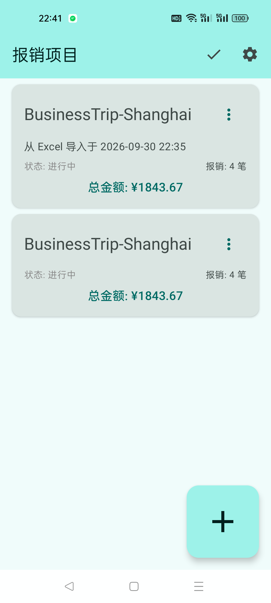
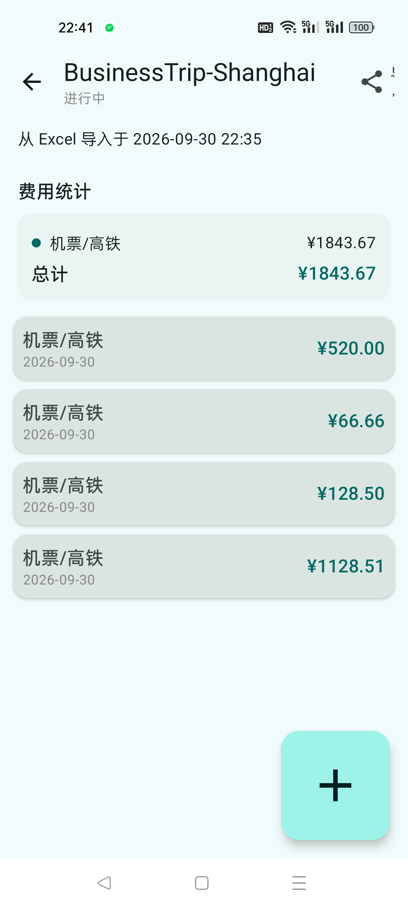
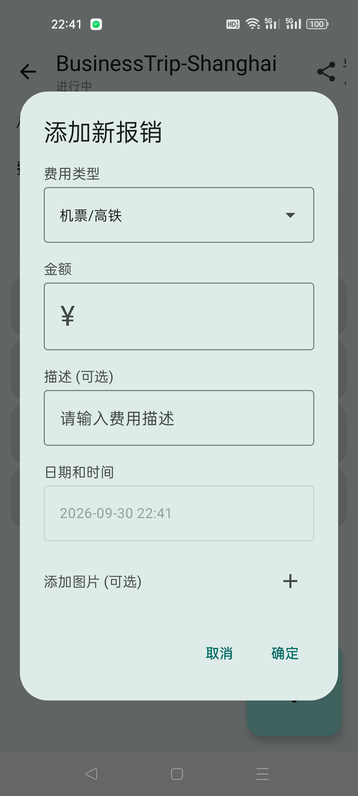

# 票夹 · FaP2

一个自己用的 Android 报销票据管理小工具：按项目归集差旅票据，随手拍照存档，最后一键导成带图的 Excel 交给财务。

用 Kotlin + Jetpack Compose 写的，纯本地存储、不联网。

## 功能

- **项目管理**：新建 / 编辑 / 删除项目，标记完成或恢复为进行中，按状态筛选
- **报销记录**：四种费用类型（机票/高铁、滴滴/出行、酒店住宿、其他费用），金额、描述、时间，可挂多张票据照片
- **费用统计**：项目内按类型小计 + 总计，列表页显示每个项目的笔数与总额
- **票据照片**：选中的照片会复制进应用私有目录，删除报销时同步清理，不留垃圾文件
- **导出**：走系统文件保存（SAF）
  - 没有照片 → 导出 `.xlsx`，含「统计概览」和每个项目一张明细表
  - 有照片 → 导出 `.zip`，内含一份 `.xlsx` 和 `images/` 目录下的原图
- **导入**：读取 `.xlsx`，自动识别表头所在行、跳过小计/总计行，每个含有效表头的工作表导入为一个项目

## 截图

| 项目列表 | 项目详情 | 新增报销 |
| --- | --- | --- |
|  |  |  |

## 构建

环境要求：JDK 17+、Android SDK（compileSdk 35）。

在仓库根目录建一个 `local.properties` 指向本机 SDK：

```properties
sdk.dir=/path/to/Android/Sdk
```

然后：

```bash
./gradlew assembleDebug
# 产物：app/build/outputs/apk/debug/app-debug.apk
```

装到设备上：

```bash
adb install -r app/build/outputs/apk/debug/app-debug.apk
```

> 构建时把 `--project-cache-dir` 指到本地磁盘可以规避 Gradle 项目缓存目录被占用/拒绝访问导致的 `fileHashes.lock` 报错：
> `./gradlew assembleDebug --project-cache-dir=/path/to/tmp/gcache`

## 技术栈

| 用途 | 选型 |
| --- | --- |
| UI | Jetpack Compose + Material 3（动态取色） |
| 本地存储 | Room 2.6.1（`fallbackToDestructiveMigration`） |
| 图片加载 | Coil 2.5 |
| Excel 读写 | Apache POI 5.2.5 |
| 异步 | Kotlin Coroutines + Flow |

最低支持 Android 8.0（API 26），目标 API 35。

## 目录结构

```
app/src/main/java/com/qqmmxx/piaojia/
├── MainActivity.kt              单一 Activity + 手写两页导航 + 双击退出
├── data/
│   ├── AppDatabase.kt           Room 数据库
│   ├── ImageManager.kt          票据图片的复制 / 解析 / 清理
│   └── dao/                     ProjectDao / ExpenseDao
├── model/                       实体、领域模型、金额格式化
├── repository/                  ExpenseRepository
├── viewmodel/                   ExpenseViewModel（含 Excel 导入导出）
└── ui/screens/                  列表页 / 详情页 / 两个表单弹窗 / 图片选择器
```

## 已知限制

- 导入只还原文本数据，不含照片（导出 zip 里的图片不会回填）
- 数据库升级走 `fallbackToDestructiveMigration`，改 schema 会清空本地数据；建议先导出备份
- 报销的日期默认取当前时间，暂时不支持手动修改（补录旧票据时需要先改代码）
- `exportSchema = true`，schema 快照在 `app/schemas/`

## License

[MIT](LICENSE)
